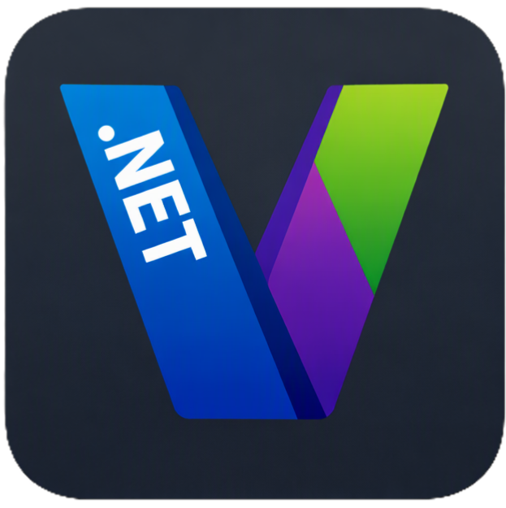

# DotnetVersionReader



A .NET global tool for reading version information from `.csproj`, `.sln`, and `.slnx` files.

[](https://github.com/wertzui/DotnetVersionReader/actions/workflows/build-test-pack-publish.yml)
[](https://www.nuget.org/packages/DotnetVersionReader)

## Installation

```bash
dotnet tool install --global DotnetVersionReader
```

Or from a local build:

```bash
dotnet pack src/DotnetVersionReader -c Release
dotnet tool install --global --add-source ./src/DotnetVersionReader/bin/Release DotnetVersionReader
```

## Usage

```
dotnet-version-reader [<input>] [--output <format>] [--filter <XmlNode=Value>]...
```

### Arguments

| Argument | Description |
|----------|-------------|
| `<input>` | Path to a `.csproj`, `.sln`, `.slnx` file **or** a folder. Defaults to the current directory. |

### Options

| Option | Short | Description |
|--------|-------|-------------|
| `--output` | `-o` | Output format: `json` (default) or `table`. |
| `--filter` | `-f` | Filter in the form `XmlNode=Value`. Value can be a regex. Repeatable. |

### Version resolution

The tool follows the same semantics as MSBuild:

1. If `<Version>` is set, it is used as-is.
2. Otherwise the version is `<VersionPrefix>` (default `1.0.0`) optionally followed by `-<VersionSuffix>`.

### Examples

```bash
# Current directory – JSON output (default)
dotnet-version-reader

# Specific solution file – table output
dotnet-version-reader MySolution.slnx --output table

# Only projects that generate a NuGet package
dotnet-version-reader --filter "GeneratePackageOnBuild=true"

# Combine multiple filters (all must match)
dotnet-version-reader MySolution.slnx --filter "TargetFramework=^net10\\.0$" --filter "GeneratePackageOnBuild=true"
```

### Sample JSON output

```json
[
  {
    "Name": "MyLibrary",
    "Version": "2.1.0-rc.1"
  },
  {
    "Name": "MyApp",
    "Version": "1.0.0"
  }
]
```

### Sample table output

```
Name       Version
---------  -------
MyLibrary  2.1.0-rc.1
MyApp      1.0.0
```

## Development

```bash
# Restore & build
dotnet build DotnetVersionReader.slnx

# Run tests
dotnet test DotnetVersionReader.slnx

# Pack
dotnet pack DotnetVersionReader.slnx -c Release
```

## CI / CD

The repository uses a single GitHub Actions workflow
(`.github/workflows/build-test-pack-publish.yml`) that runs automatically on
every push to `main` and can also be triggered manually.

### What the workflow does

| Step | Details |
|------|---------|
| **Restore** | `dotnet restore` against the `.slnx` solution file |
| **Build** | `dotnet build -c Release` (no restore) |
| **Test** | `dotnet test -c Release --no-build` |
| **Collect metadata** | Runs the freshly built `DotnetVersionReader.exe` with the solution file and `-f GeneratePackageOnBuild=true` to enumerate all package names + versions |
| **Tag commits** | Pushes an annotated git tag per package (`<Name>-v<Version>`) plus one combined release tag |
| **Publish to NuGet** | Pushes every `.nupkg` to `nuget.org` with `--skip-duplicate` |
| **GitHub Release** | Creates a GitHub release on the combined tag and uploads all `.nupkg` files as assets |

### Required repository secret

| Secret | Description |
|--------|-------------|
| `NUGET_API_KEY` | API key from [nuget.org](https://www.nuget.org/account/apikeys) with push permission for the package(s) |

Add it under **Settings → Secrets and variables → Actions → New repository secret**.

### Manual dispatch

The workflow can be triggered manually from the **Actions** tab.  
An optional `slnx_file` input lets you override the solution path
(default: `DotnetVersionReader.slnx`).

